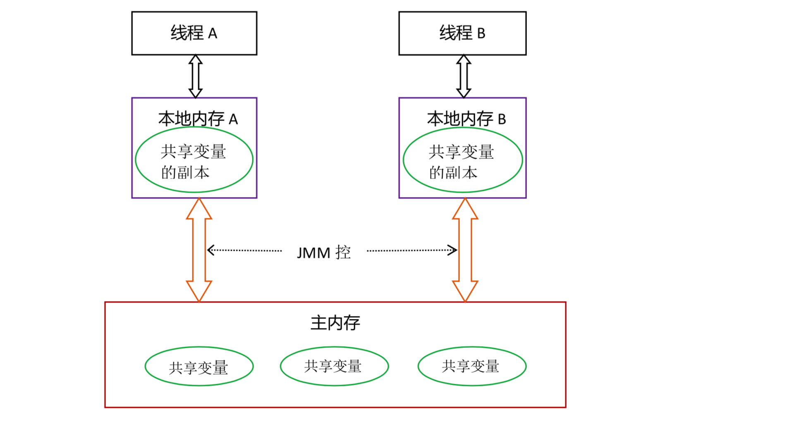
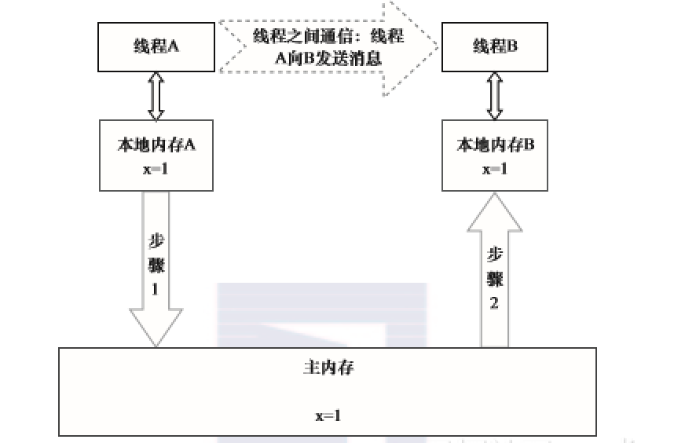

# 基础

## 可见性、原子性、有序性
* CPU 增加了缓存，以均衡与内存的速度差异。// 导致 可见性问题
* 操作系统增加了进程、线程，以分时复用 CPU，进而均衡 CPU 与 I/O 设备的速度差异。// 导致原子性 问题
* 编译程序优化指令执行次序，使得缓存能够得到更加合理地利用。// 导致 有序性问题 
  
  
## 并发编程模型的分类
在并发编程中，需要处理2个关键问题：
* 线程之间如何通信
* 线程之间如何同步  
  
通信是指线程之间以何种机制来交换信息。在命令模式里面，线程之间的通信机制有2种：`共享内存`和`消息传递`  
在`共享内存`的并发模型里，线程之间共享程序的公共状态，通过写-读内存中的公共状态进行隐式通信。  
在`消息传递`的并发模型里，线程之间没有公共状态，线程之间必须通过发送消息来显式进行通信。  
  
`同步`是指程序中用于控制不同线程间操作发生相对顺序的机制。  
在共享内存并发模型里，同步是显式进行的。程序员必须显式指定某个方法或某段代码需要在线程之间互斥执行。  
在消息传递的并发模型里，由于消息的发送必须在消息的接收之前，因此同步是隐式进行的。 
   
`Java的并发采用的是共享内存模型`，Java线程之间的通信总是隐式进行，整个通信过程对程序员完全透明。  

## Java内存模型的抽象
在Java中，所有实例域、静态域和数组元素都存储在堆内存中，堆内存在线程之间共享。  
局部变量，方法定义参数和异常处理器参数不会在线程之间共享，它们不会有内存可见性问题，也不受内存模型的影响。  
Java线程之间的通信由Java内存模型（简称为JMM）控制，JMM决定一个线程对共享变量的写入何时对另一个线程可见。  
从抽象的角度来看，JMM定义了线程和主内存之间的抽象关系：  
线程之间的共享变量存储在主内存（Main Memory）中，  
每个线程都有一个私有的本地内存（Local Memory），  
本地内存中存储了该线程以读/写共享变量的副本。  
本地内存是JMM的一个抽象概念，并不真实存在。  
它涵盖了缓存、写缓冲区、寄存器以及其他的硬件和编译器优化。  
Java内存模型的抽象示意图如下。
  
从图3-1来看，如果线程A与线程B之间要通信的话，必须要经历下面2个步骤。  
1）线程A把本地内存A中更新过的共享变量刷新到主内存中去。  
2）线程B到主内存中去读取线程A之前已更新过的共享变量。  
下面再通过示意图来说明这两个步骤。  
   
本地内存A和本地内存B有主内存中共享变量x的副本。假设初始时，这3个内存中的x值都为0。  
线程A在执行时，把更新后的x值（假设值为1）临时存放在自己的本地内存A中。  
当线程A和线程B需要通信时，线程A首先会把自己本地内存中修改后的x值刷新到主内存中，此时主内存中的x值变为了1。  
随后，线程B到主内存中去读取线程A更新后的x值，此时线程B的本地内存的x值也变为了1。  
从整体来看，这两个步骤实质上是线程A在向线程B发送消息，而且这个通信过程必须要经过主内存。  
JMM通过控制主内存与每个线程的本地内存之间的交互，来为Java程序员提供内存可见性保证。  

## 从源代码到指令序列的重排序
在执行程序时，为了提高性能，`编译器`和`处理器`常常会对指令做重排序。重排序分3种类型。
1. `编译器优化`的重排序。编译器在不改变单线程程序语义的前提下，可以重新安排语句的执行顺序。
2. `指令级并行`的重排序。现代处理器采用了指令级并行技术来将多条指令重叠执行。如果不存在数据依赖性，  
处理器可以改变语句对应机器指令的执行顺序。
3. `内存系统`的重排序。由于处理器使用缓存和读/写缓冲区，这使得加载和存储操作看上去可能是在乱序执行。
  
从Java源代码到最终实际执行的指令序列，会分别经历下面3种重排序.
   
1属于编译器重排序，2和3属于处理器重排序。  
这些重排序可能会导致多线程程序出现内存可见性问题。  
对于编译器，JMM的编译器重排序规则会禁止特定类型的编译器重排序（不是所有的编译器重排序都要禁止）。   
对于处理器重排序，JMM的处理器重排序规则会要求Java编译器在生成指令序列时，插入特定类型的内存屏障指令，  
通过内存屏障指令来禁止特定类型的处理器重排序。  
JMM属于语言级的内存模型，它确保在不同的编译器和不同的处理器平台之上，  
通过禁止特定类型的编译器重排序和处理器重排序， 
为程序员提供一致的内存可见性保证。  

## 处理器重排序
因此，在执行程序时，为了提高性能，编译器和处理器常常会对指令进行重排序。  
一般重排序可以分为如下三种：  
* 编译器优化的重排序。编译器在不改变单线程程序语义的前提下，可以重新安排语句的执行顺序;
* 指令级并行的重排序。现代处理器采用了指令级并行技术来将多条指令重叠执行。如果不存在数据依赖性，处理器可以改变语句对应机器指令的执行顺序;
* 内存系统的重排序。由于处理器使用缓存和读/写缓冲区，这使得加载和存储操作看上去可能是在乱序执行的。
  
## 内存屏障
java编译器会在生成指令系列时在适当的位置会插入内存屏障指令来禁止特定类型的处理器重排序。  
为了实现volatile的内存语义，JMM会限制特定类型的编译器和处理器重排序，JMM会针对编译器制定volatile重排序规则表  
需要注意的是：volatile写是在前面和后面分别插入内存屏障，而volatile读操作是在后面插入两个内存屏障。  
  
## as-if-serial
不管怎么重排序，单线程下的执行结果不能被改变。  
编译器、runtime和处理器都必须遵守as-if-serial语义。  
  
## happens-before
如果一个操作执行的结果需要对另一个操作可见，那么这两个操作之间必须存在happens-before关系。  
  
## volatile域规则
对一个volatile域的写操作，happens-before于任意线程后续对这个volatile域的读。  
   
## volatile 总结
* volatile 修饰符适用于以下场景：某个属性被多个线程共享，其中有一个线程修改了此属性，其他线程可以立即得到修改后的值；或者作为状态变量，如 flag = ture，实现轻量级同步。
* volatile 属性的读写操作都是无锁的，它不能替代 synchronized，因为它没有提供原子性和互斥性。因为无锁，不需要花费时间在获取锁和释放锁上，所以说它是低成本的。
* volatile 只能作用于属性，我们用 volatile 修饰属性，这样编译器就不会对这个属性做指令重排序。
* volatile 提供了可见性，任何一个线程对其的修改将立马对其他线程可见。volatile 属性不会被线程缓存，始终从主存中读取。
* volatile 提供了 happens-before 保证，对 volatile 变量 V 的写入 happens-before 所有其他线程后续对 V 的读操作。
* volatile 可以使纯赋值操作是原子的，如 boolean flag = true; falg = false。
* volatile 可以在单例双重检查中实现可见性和禁止指令重排序，从而保证安全性。
  
## volatile与synchronized的区别
* volatile只能修饰实例变量和类变量，而synchronized可以修饰方法，以及代码块。  
* volatile保证数据的可见性，但是不保证原子性(多线程进行写操作，不保证线程安全);而synchronized是一种排他(互斥)的机制。  
* volatile用于禁止指令重排序：可以解决单例双重检查对象初始化代码执行乱序问题。  
* volatile可以看做是轻量版的synchronized，volatile不保证原子性，但是如果是对一个共享变量进行多个线程的赋值，而没有其他的操作，那么就可以用volatile来代替synchronized，因为赋值本身是有原子性的，而volatile又保证了可见性，所以就可以保证线程安全了。
  

- [link 2 github][0]  
- [link 2 csdn][1]

*******************
[0]: https://github.com/cmshome/x/tree/master/md
[1]: https://blog.csdn.net/qq_27093465
[2]: https://blog.csdn.net/qq_27093465/article/details/108225865