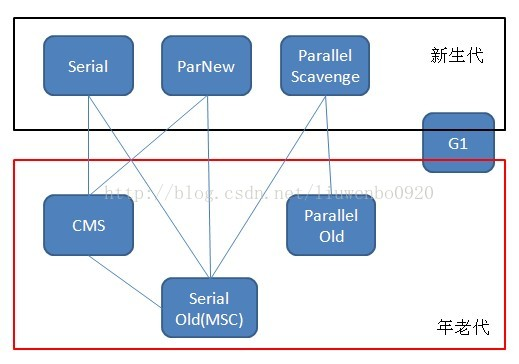

# gc算法
  
|--    |标记-清除算法         |复制算法|标记-压缩算法|分代收集算法 |
|:-----|:---                 |:----- |:-----     |:----- |
|英文名 |     Mark-Sweep     |Mark-Copying|Mark-Compact|   -    |
|简单说明 |首先标记出所有需要回收的对象 在标记完成后统一回收掉所有被标记的对象|分为大小相等的两块，用完一块，将活着的对象复制到另外一块，清理已使用过的|先标记 压缩到一端，清空|把Java堆分为新生代和老年代 就可以根据各个年代的特点采用最适当的收集算法|
|问题 |标记和清除过程的效率都不高 产生大量不连续的内存碎片|代价是将内存缩小一半 持续复制长生存期的对象则导致效率降低|在移动存活对象的过程中，需要全程暂停用户程序的执行 被设计者称为“Stop The World”。|发生GC(MinorGC或者FullGC)时，都会将用户线程停顿并进行垃圾收集|

  
# gc器
   

|--    |Serial |ParNew|Parallel Scavenge|Parallel Old     |Serial old     |CMS      |G1          |
|:-----|:---   |:----- |:-----          |:-----           |:-----         |:-----   |:-----      |
|where|新生代   |新生代 |   新生代        |  老年代          |  老年代        | 老年代   | 新生代 老年代       |
|特点|串行    | 并行   |   并行         |  并行        |    串行       |    并发  |  并发        |
|算法 |标记-复制 |标记-复制|标记-复制      | 标记-整理         |标记-整理       |标记-清除 | 标记-整理 复制算法|
|STW  |是      | 是    |   是           |    是            |   是          | 是      |  是        |
|目标  |响应速度优先|响应速度优先|吞吐量优先|  吞吐量优先| 响应速度优先 |响应速度优先| 响应速度优先 |
|优点|额外内存消耗最小 没有线程交互的开销|除了Serial收集器，只有ParNew能够与CMS收集器配合工作|自适应策略| 注重吞吐量 |               |并发收集、低停顿|         |
|缺点|管的多则停的久|       |         |       |               |降低总吞吐量 无法清除浮动垃圾 产生碎片 |         |
|适用场景|单CPU环境下的Client模式|多CPU环境时在Server模式下与CMS配合|在后台运算而不需要太多交互的任务|在后台运算而不需要太多交互的任务| 单CPU环境下的Client模式、CMS的后备预案 |集中在互联网站或B/S系统服务端上的Java应用 | 面向服务端应用，将来替换CMS |

  

   
   
## 对不同区域进行收集的名词
* 串行（Serial）：指用户线程与垃圾收集线程不能同时执行，只能有一类在工作。
* 并行（Parallel）：指多条垃圾收集线程并行工作，但此时用户线程仍然处于等待状态。
* 并发（Concurrent）：指用户线程与垃圾收集线程同时执行（但不一定是并行的，可能会交替执行），用户程序在继续运行。而垃圾收集程序运行在另一个CPU上。
* Minor GC（新生代收集）   minor ：小，较小的意思
* Major GC（老年代收集）
* Full GC（整个Java堆和方法区的收集）
* Mixed GC（新生代收集和部分老年代的收集，目前只有G1收集器有这种行为）
* Stop The World（发生GC(MinorGC或者FullGC)时，都会将用户线程停顿并进行垃圾收集，在Minor GC中，STW的时间较短，只涉及Eden和survivor区域的对象清除和复制操作，而Full GC则是对整个堆内存进行垃圾收集，对象的扫描、标记和清除操作工作量大大提高，所以Full GC会导致用户线程停顿较长时间，如果频繁地发生Full GC，那么用户线程将无法正常执行。）
  
  
  
## CMS收集器
CMS（Concurrent Mark Sweep）收集器是一种以获取`最短回收停顿时间`为目标的收集器，它非常符合那些集中在互联网站或者B/S系统的服务端上的Java应用，这些应用都非常重视服务的`响应速度`。从名字上（“Mark Sweep”）就可以看出它是基于**“标记-清除”**算法实现的。  
CMS收集器工作的整个流程分为以下4个步骤：
* 初始标记（CMS initial mark）：仅仅只是标记一下GC Roots能直接关联到的对象，速度很快，需要“Stop The World”。
* 并发标记（CMS concurrent mark）：进行GC Roots Tracing的过程，在整个过程中耗时最长。
* 重新标记（CMS remark）：为了修正并发标记期间因用户程序继续运作而导致标记产生变动的那一部分对象的标记记录，这个阶段的停顿时间一般会比初始标记阶段稍长一些，但远比并发标记的时间短。此阶段也需要“Stop The World”。
* 并发清除（CMS concurrent sweep）
  
CMS收集器有三个缺点：  
* `对处理器资源特别敏感`，由于是并发执行，所以CMS收集器工作时会占用一部分CPU资源而导致用户程序变慢，降低总吞吐量，建议具有四核处理器以上的服务器使用CMS收集器
* `CMS无法清除浮动垃圾`，有可能出现Concurrent Mode Failure失败而导致另一次STW的Full GC产生。由于并发清理过程中用户线程与GC线程并发执行，就一定会产生新的垃圾对象，但是无法在本次GC中处理这些垃圾对象，不得不推迟到下一次GC中处理，这些垃圾对象就称为“浮动垃圾”，到JDK6的时候，CMS收集器启动阈值达到92%，也就是老年代占了92%的空间后会触发GC，但是如果剩余的内存8%不足以分配新对象时，就会发生“并发失败”，进而冻结用户线程，使用Serial Old收集器进行一次Full GC，所以触发CMS收集器的阈值还是根据实际场景来设置，参数为-XX:CMSInitiatingOccu-pancyFraction。
* `基于标记-清除算法会导致内存碎片不断增多`，在分配大对象时有可能会提前触发一次Full GC。所以CMS提供两个参数可供开发者指定在每次Full GC时进行碎片整理，由于碎片整理需要移动对象，所以是无法并发收集的，-XX:+UseCMSCompactAtFullCollection(JDK9开始废弃)，-XX:CMSFullGCsBeforeCompaction(JDK9开始废弃，默认值是0，每次Full GC都进行碎片整理)。

## G1收集器
G1（Garbage-First）收集器是当今收集器技术发展最前沿的成果之一，它是一款面向服务端应用的垃圾收集器，HotSpot开发团队赋予它的使命是（在比较长期的）未来可以替换掉JDK 1.5中发布的CMS收集器。与其他GC收集器相比，G1具备如下特点：
* 并行与并发 G1 能充分利用多CPU、多核环境下的硬件优势，使用多个CPU来缩短“Stop The World”停顿时间，部分其他收集器原本需要停顿Java线程执行的GC动作，G1收集器仍然可以通过并发的方式让Java程序继续执行。
* 分代收集 与其他收集器一样，分代概念在G1中依然得以保留。虽然G1可以不需要其他收集器配合就能独立管理整个GC堆，但它能够采用不同方式去处理新创建的对象和已存活一段时间、熬过多次GC的旧对象来获取更好的收集效果。
* 空间整合 G1从整体来看是基于**“标记-整理”算法实现的收集器，从局部（两个Region之间）上来看是基于“复制”**算法实现的。这意味着G1运行期间不会产生内存空间碎片，收集后能提供规整的可用内存。此特性有利于程序长时间运行，分配大对象时不会因为无法找到连续内存空间而提前触发下一次GC。
* 可预测的停顿 这是G1相对CMS的一大优势，降低停顿时间是G1和CMS共同的关注点，但G1除了降低停顿外，还能建立可预测的停顿时间模型，能让使用者明确指定在一个长度为M毫秒的时间片段内，消耗在GC上的时间不得超过N毫秒，这几乎已经是实时Java（RTSJ）的垃圾收集器的特征了。
  
整个流程   
* 初始标记：仅记录GC Roots对象，需要停顿用户线程，但时间很短，借助Minor GC同步完成。
* 并发标记：从GC Roots开始遍历扫描所有的对象进行可达性分析，找出要回收的对象，由于是并发标记，有可能在扫描过程中出现引用变动。
* 最终标记：将并发标记过程中出现变动的对象引用给纠正过来。
* 筛选回收：对各个Region的回收价值和成本进行排序，根据用户所希望的停顿时间来制定回收计划，选取任意多个Region区域进行回收，把回收的Region区域中的存活对象复制到空的Region区域中，然后清空掉原来的Region区域，涉及对象的移动，所以需要暂停用户线程，由多条GC线程并行完成。

## G1和CMS的比较
  
* G1从整体上看是“标记-整理”算法，从局部（两个Region之间）上看是“标记-复制”算法，不会产生内存碎片，而CMS基于“标记-清除”算法会产生内存碎片。
* G1在垃圾收集时产生的内存占用和程勋运行时的额外负载都比CMS高
* G1支持动态指定停顿时间，而CMS无法指定
* 两者都利用了并发标记这个技术

